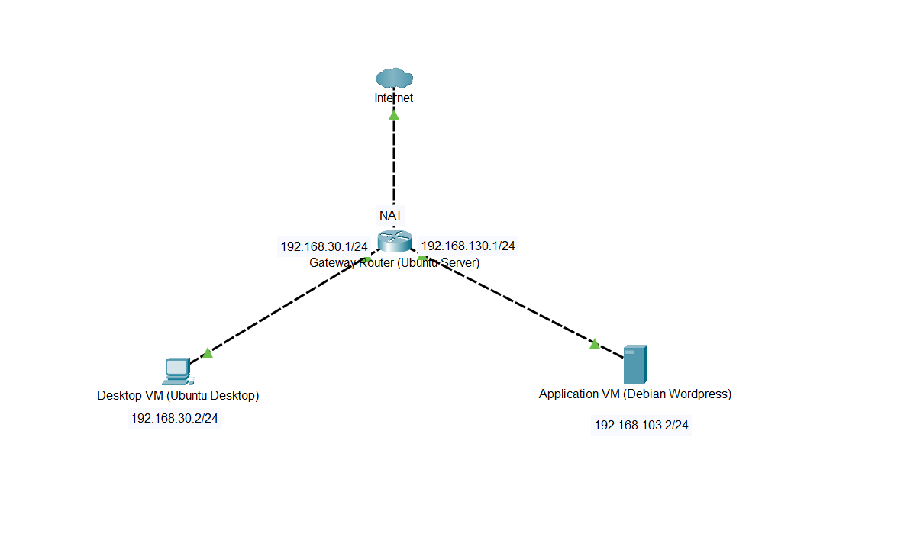

This is my step-by-step implementation of a sandboxed network using VirtualBox. The network consists of three VMs: a Desktop VM, a Gateway VM, and an Application VM configured in a private sandboxed environment. The network ensures secure, isolated communication.
We were giving static IP ranges to assign to our subnets and gateways. I chose **192.168.30.2** for my Desktop VM, **192.168.30.1** for the gateway VM interface card which acts as the default gateway for the desktop, **192.168.130.1** for the gateway VM interface card acting as the default gateway for the Application VM, and **192.168.130.2** for my Application VM. I also configured NAT on a third interface card on my gateway server to enable internet access.
The three VMs I used for this network are:
-	Desktop VM: Ubuntu Desktop
-	Gateway VM: Ubuntu Server
-	Application VM: Bitnami Debian WordPress   

Network Diagram
   

IP Address Table
   
  

# Prerequisites
Hardware Requirements:
- A host machine with at least 16GB of RAM and a multi-core processor.
- Sufficient disk space (minimum 50GB free).

Software Requirements:
- VirtualBox installed on the host machine.
- ISO images for the operating systems used (e.g., Ubuntu Server, Ubuntu Desktop).
- Bitnami WordPress VM for the Application Server.

Networking Knowledge:
- Basic understanding of IP addressing, routing, and firewall rules.  

# VirtualBox Setup
Create Virtual Machines: Open VirtualBox and click "New" to create the desktop VM. Choose the appropriate OS type and version, allocate memory (e.g., 2GB), and create a virtual hard disk with a suitable size (e.g., 20GB). Repeat the process to create the gateway VM and Application Server VM.  

Desktop VM:
- OS: Ubuntu Desktop.
- CPU: 2 cores.
- RAM: 4GB.
- Storage: 20GB.

Gateway VM:
- OS: Ubuntu Server.
- CPU: 2 cores.
- RAM: 2GB.
- Storage: 10GB.

Application Server VM:
- OS: Bitnami Debian WordPress.
- CPU: 2 cores.
- RAM: 4GB.
- Storage: 20GB.  

Configure Network Adapters:
- All VMs should use an Internal Network to ensure isolation. I did this by going to network settings in your VirtualBox and changing the adapters from NAT to Internal Network. Rename your Application VM adapter to match the gateway adapter used to communicate with the application server.
- Configure the Gateway VM to have three adapters:
  - Adapter 1: Internal Network for communication with Desktop VM
  - Adapter 2: NAT for internet access.
  - Adapter 3: Internal Network for communication with Application Server VM (Rename to match with Application Server Adapter)  
  
# IP Configuration Steps
**Ubuntu Desktop**:

Once logged in, I assigned the IP to the Ubuntu VM by going to my IPV4 network settings and changing the method to manual to disable DHCP. I then entered the chosen IP, gateway, and netmasks in the addresses section and applied the settings.

**Ubuntu Server**:

Once logged in, we need to assign static IP addresses to the appropriate network interfaces. I did this by editing the network configuration file using **sudo nano /etc/neplan/00-installer-config.yaml**. I edited the file to look like this:

network:

ethernets:

enp0s3: # This corresponds to the first interface (NAT)

dhcp4: true

enp0s8: # This corresponds to the second interface (Internal Network 1)

addresses:
- 192.168.30.1/24

dhcp4: false

enp0s9: # This corresponds to the third interface (Internal Network 2)

addresses:
- 192.168.130.1/24

dhcp4: false

version: 2  

I applied these changes with **sudo netplan apply** and enabled IP forwarding by uncommenting the **net.ipv4.ip_forward=1** line in the configuration file **/etc/sysctl.conf** and applied the changes with **sudo sysctl -p**.

I configured iptables to allow forwarding using:

**Allow forwarding between enp0s8 and enp0s9**

sudo iptables -A FORWARD -i enp0s8 -o enp0s9 -j ACCEPT

sudo iptables -A FORWARD -i enp0s9 -o enp0s8 -j ACCEPT  
**Allow forwarding between enp0s3 and the internal interfaces**

sudo iptables -A FORWARD -i enp0s3 -o enp0s8 -j ACCEPT

sudo iptables -A FORWARD -i enp0s8 -o enp0s3 -j ACCEPT

sudo iptables -A FORWARD -i enp0s3 -o enp0s9 -j ACCEPT

sudo iptables -A FORWARD -i enp0s9 -o enp0s3 -j ACCEPT  
**Enable NAT on enp0s3 for internet access**

sudo iptables -t nat -A POSTROUTING -o enp0s3 -j MASQUERADE 

and made the changes permanent using:

sudo apt install iptables-persistent

sudo netfilter-persistent save

sudo netfilter-persistent reload  

**Bitnami Debian WordPress**:

Once logged in, I applied the chosen static IP address by editing the network configuration file using **sudo nano /etc/network/interfaces**. I edited it to look like:

auto enp0s3

iface enp0s3 inet static

address 192.168.130.2

netmask 255.255.255.0

gateway 192.168.130.1

and applied changes by doing a reboot using sudo reboot.  

# Functional Test Results
<figure>
  <video width="640" height="360" controls>
    <source src="Docs/Functional_Test_Results/Ubuntu _A00020435_-screen0.webm" type="video/webm">
    Your browser does not support the video tag.
  </video>
  <figcaption>Video 1: Desktop VM (Ubuntu Desktop)</figcaption>
</figure>
  
<figure>
  <video width="640" height="360" controls>
    <source src="Docs/Functional_Test_Results/Server _A00020435_-screen0.webm" type="video/webm">
    Your browser does not support the video tag.
  </video>
  <figcaption>Video 2: Gateway VM (Ubuntu Server)</figcaption>
</figure>
  
<figure>
  <video width="640" height="360" controls>
    <source src="Docs/Functional_Test_Results/common-wordpress-6-6.6.2-r6-debian-12-amd64-screen0.webm" type="video/webm">
    Your browser does not support the video tag.
  </video>
  <figcaption>Video 3: Application VM (Bitnami Debian Wordpress)</figcaption>
</figure>
